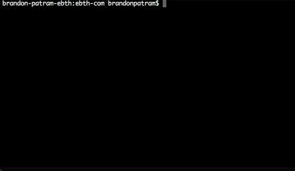

# Scripts

General purpose scripts to automate common tasks.

- Git
  - [`branch-tidy`](#branch-tidysh)
  - [`inplace-pull`](#inplace-pullsh)
  - [`glob-changed-files`](#glob-changed-filessh)
- Plantuml
  - [`ss_std`](#ss_stdpuml-for-plantuml-v2020-and-later) (current, post-v2020)
  - [`_default_styles`](#_default_stylespuml-for-plantuml-v2020-and-before) (pre-v2020)
- AWS
  - [`sts-login.sh`](#sts-loginsh)

## Git

### `branch-tidy.sh`

`branch-tidy.sh [-C $(pwd)] [-b master] [-r origin] [-v] [-y]`

Find local branches that are merged (or have been squashed into a single merge commit) into master or branches which have been removed on the remote and then prompt to delete some or all of them.

This is useful when you are merging PRs from another service (GitHub, etc) and want to also clean up your local branches that are completed (merged). If you use squash commit merges then this script becomes increasingly helpful as it can check for squashed branches too. If you have configured GitHub to delete your branch after merging or deleting, this will also work with that too, as those branches are considered "stale."

#### Example Output



_NOTE: Please ignore that the script was renamed in the screenshot_

#### Invoke Externally (macOS)

Use the `extern-branch-tidy.sh` file. This will run a JSX command to create a new terminal session and execute the shell script then exit the session.

This is useful for tools like [Fork](https://git-fork.com/) where you can invoke custom scripts but doesn't support user input. Spawning a terminal window is a way to work around that limitation.

### `inplace-pull.sh`

`inplace-pull.sh [path_to_repo=$(pwd)] [branch to pull=master]`

Pull a branch down without losing your current state. This will stash your current changes and re-apply them after pulling down the target branch (or master if not defined).

This is useful to run when you've been working on your local branch and are now a few commits behind the current master and want to rebase. Run this then rebase your branch to catch it back up.

#### Example Output

```bash
$ ../inplace-pull.sh
No target branch specified. Will use master instead
Stashing current changes: DEE55FE5-32CE-4A22-B5BC-5346E08F1B84...
Pulling master...
Restoring original state of item-progress/aggregate-checks...
Done!
```

### `glob-changed-files.sh`

`glob-changed-files.sh [regex_pattern] [to_commit=HEAD] [from_commit=origin/master]`

List all files in glob format that have changed in between a specific commit and master that match the passed regex pattern. This command takes in 3 potential arguments, the last two being optional.

#### Example Usage

```bash
$ ../glob-changed-files.sh "\\.(scss|css)"
{this.css,that.scss}
```

## Plantuml

### `ss_std.puml` (for PlantUML v2020 and later)

You can include this file into your Plantuml diagrams to opt into some better looking styles and some common diagram components. To start using this today in the easier manner you can define your diagram like this

```
@startuml
!include https://raw.githubusercontent.com/slewsystems/scripts/master/plantuml/ss_std.puml
!$title = "My Diagram"
!$company_name = "ACME Corp"
!$author_name = "John Smith"
!$revision_name = "1"

$setup_std_diagram_for("<diagram-type>")

' Diagram stuff here!

@enduml
```

| Procedure/Variables              | Purpose                                                                                |
| -------------------------------- | -------------------------------------------------------------------------------------- |
| `$setup_std_diagram_for("type")` | Adds default styles to your diagram (see diagram styles section below)                 |
| `$use_word_wrap()`               | Apply word wrapping to long text                                                       |
| `$use_horizontal_layout()`       | Apply left to right direction (instead of top to bottom)                               |
| `$title`                         | Variable for storing Title name, used in standard header and title                     |
| `$author_name`                   | Variable for storing Author name, used in standard header and titles                   |
| `$company_name`                  | Variable for storing Company name, used in standard header and footer                  |
| `$revision_name`                 | Variable for storing diagram Revision, used in standard header                         |
| `$confidential`                  | Either `%true()` or `%false()` (default is true). Will append "Condifential" to footer |

#### Supported diagram styles

When calling `$setup_std_diagram_for` you must pass in a diagram type name as the first argument in order to apply the correct styles for that diagram type. The current possible diagram types you can style are:

- `$setup_std_diagram_for("sequence")`
- `$setup_std_diagram_for("activity")`
- `$setup_std_diagram_for("sequence")`
- `$setup_std_diagram_for("state")`
- `$setup_std_diagram_for("class")`
- `$setup_std_diagram_for("er")`
- `$setup_std_diagram_for("generic")`

#### Some gotchas

- Set your document variables _before_ calling `$setup_std_diagram_for(...)`

### `_default_styles.puml` (for PlantUML v2020 and before)

You can include this file into your Plantuml diagrams to opt into some better looking styles and some common diagram components. To start using this today in the easier manner you can append the following to the very top of your diagram (within `@startuml`):

```
!includeurl https://raw.githubusercontent.com/slewsystems/scripts/master/plantuml/_default_styles.puml
```

#### Styles

Add `USE_DEFAULT_STYLES()` into your diagram to style Component, Sequence, Activity, and Class Diagrams! See ERD section below for adding styles for ER diagrams. If you would like to opt-in to word wrapping of notes, descriptions and arrow lines you can add `USE_WORD_WRAP()`. This will default to 125 characters, you can change this by passing a parameter, for example: `USE_WORD_WRAP(100)`

#### Common Components

##### Header

To stamp your diagram with your name, company, and a revision number you can add `header STD_HEADER` into your diagram. To set your name simply add `!define AUTHOR_NAME First Last` to your diagram and replace "First Last" with your own name. To set a company name add `!define COMPANY_NAME Company Name` to your diagram and replace "Company Name" with your own company name.

##### Footer

To stamp your diagram with a confidential notice you can add `footer STD_FOOTER` into your diagram. To set a company name add `!define COMPANY_NAME Company Name` to your diagram and replace "Company Name" with your own company name.

#### ERD

Due to some styling conflicts and limitations from Plantuml we must also append `USE_ERD_STYLES()` after adding `USE_DEFAULT_STYLES()` to correctly style ER diagrams without breaking existing Class Diagrams.

A new object type is added called `table`. You can use it like this:

```puml
USE_DEFAULT_STYLES()
USE_ERD_STYLES()

enum_mapping(REPORT_STATUS_ENUM, INT(11)) {
    incomplete: 0
    complete: 1
    not_applicable: 2
}

table(items) {
    column_pk()
    omitted_columns()
}

table(items_progress_report_caches) {
    column_pk()
    timestamps()
    column_fk(item_id)

    column_non_nullable(photos_uploaded, REPORT_STATUS_ENUM)
    column_non_nullable(photo_editing_work, REPORT_STATUS_ENUM)
    column_non_nullable(attribution_work, REPORT_STATUS_ENUM)
    column_non_nullable(remote_cataloging_work, REPORT_STATUS_ENUM)
    column_non_nullable(required_attributes_defined, REPORT_STATUS_ENUM)
    column_non_nullable(description_defined, REPORT_STATUS_ENUM)
    column_non_nullable(contract_defined, REPORT_STATUS_ENUM)
    column_non_nullable(condition_defined, REPORT_STATUS_ENUM)
    column_non_nullable(measurements_defined, REPORT_STATUS_ENUM)
    column_non_nullable(active, REPORT_STATUS_ENUM)
    column_non_nullable(origin_type_defined, REPORT_STATUS_ENUM)
    column_non_nullable(parcels_created, REPORT_STATUS_ENUM)
    column_non_nullable(editing_completed, REPORT_STATUS_ENUM)
}

has_one(items_progress_report_caches, items)
```

## AWS

### `sts-login.sh`

`sts-login.sh -t "MFA_TOKEN_CODE" -s "arn:aws:iam:MFA_ARN/USERNAME" [-p PROFILE_NAME="default"]`

Easily login to AWS CLI using a MFA device (2FA) without the hassle.
